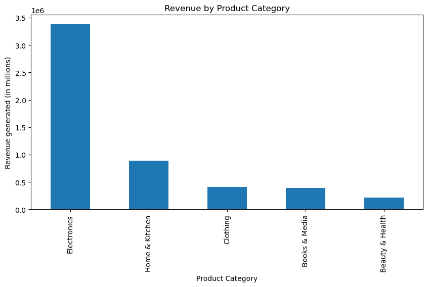
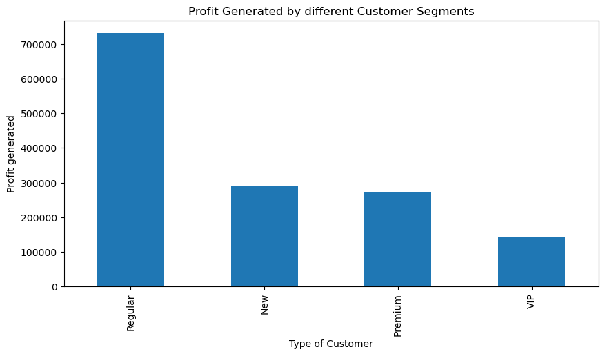
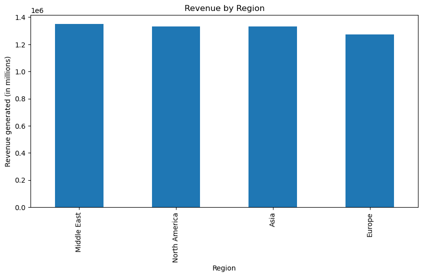
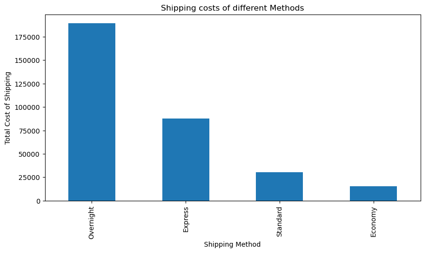
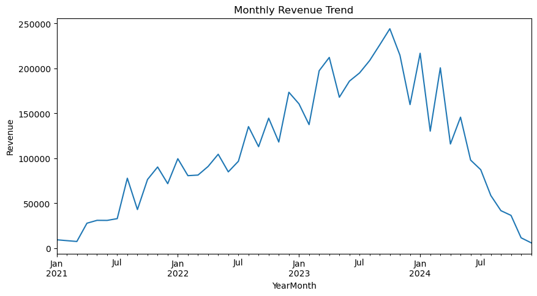
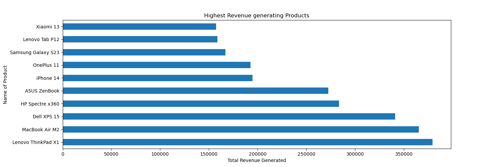

# E-Commerce Sales Analysis

## Objective
The objective of this project is to analyze sales performance, customer behavior, product categories, and profitability within an e-commerce business to identify key business insights and trends.

## Dataset Overview
* The dataset contains 10,000 rows and 26 columns.
* No duplicate records or missing values were found.
* The data includes information related to orders, customers, products, sales, costs, profits, shipping, payment methods, and order status.
* Date columns were converted to datetime format to enable time-based analysis.

## Tools Used
* Python
* Pandas
* Matplotlib
* Jupyter Notebook

## Data Cleaning and Preprocessing
* Checked for missing values and duplicate records.
* Verified data types across all columns.
* Converted date columns from object to datetime format.
* Created date-based features for trend analysis.

## Exploratory Data Analysis
The analysis focused on key business metrics and performance indicators, including:
* Revenue, cost and profit analysis.
* Regional sales performance.
* Product category performance.
* Customer segment analysis.
* Payment method analysis.
* Top-performing products.
* Revenue trends over time.

## Key Findings
* The business generated over 5.28 million in revenue and 1.44 million in profit from 5,348 unique customers.
* The Middle East was the highest revenue-generating region.
* Electronics was the top-performing category, contributing the highest revenue and profit.
* Regular customers generated the highest overall profit.
* Technology products such as Lenovo ThinkPad X1 and MacBook Air M2 were among the highest revenue-generating products.
* Revenue showed steady growth from 2021 to 2023 before declining during 2024.

## Visualizations
The project includes visualizations covering:
- Revenue by Category

- Profit by Customer Segments

- Revenue by Region

- Shipping Cost of different Methods

- Monthly Revenue Trend

- Top 10 Products by Revenue

## Conclusion
* The business demonstrates strong overall profitability with substantial revenue generation.
* Electronics is the primary driver of both revenue and profit.
* The Middle East represents the strongest-performing market by revenue.
* Customer retention appears important, as regular customers contribute the highest profit.
* The decline in revenue during 2024 may require further investigation to identify underlying causes.

## Project Files
* [Jupyter Notebook](Ecommerce_Analysis.ipynb)
* [Dataset](ecommerce_sales_dataset.csv)
